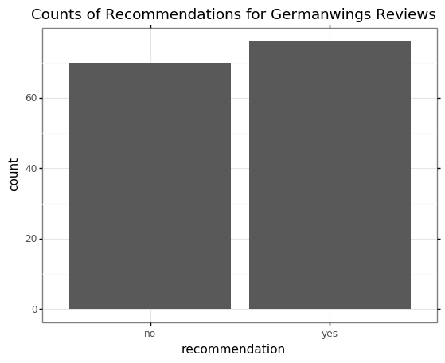
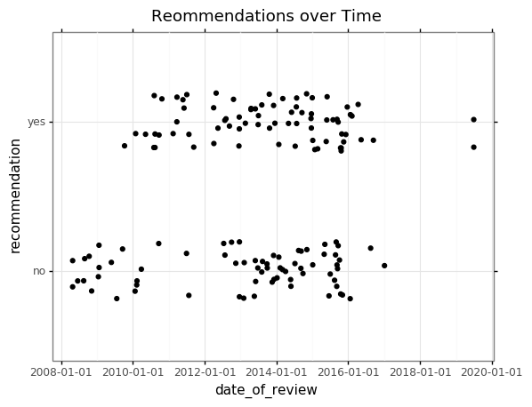
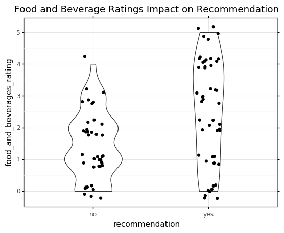
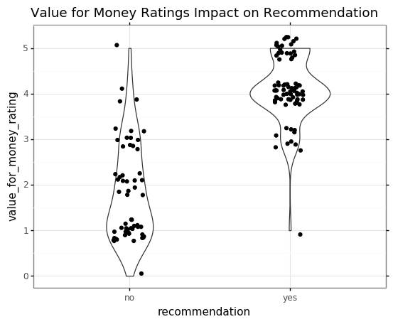

# Germanwings Review Analysis Report
#### Evan Yathon

### Overview

Germanwings is [a low-cost airline owned by Lufthansa, operating under the Eurowings brand](https://en.wikipedia.org/wiki/Germanwings).  Customers sometimes review the flight service on a website such as [airlinequality.com](airlinequality.com).  This analysis will focus on several reviews from this website.

In each review there is a final recommendation, either recommending Germanwings or not.  These reviews can be very important for a company, as in the age of online reviews much of our decision making can be swayed by online opinion.  It would be valuable to see what factors influence a recommendation.  

My goal for this project is to attempt to see which features are important and what their influence is on a customers recommendation.

### Scraping

When looking at the [original data](data/given_4U_reviews.txt) I noticed that the categories such as 'seat comfort' or 'ground service' were populated with only the value `12345`.  I searched some of the customer reviews and found that the data had come from [www.airlinequality.com](www.airlinequality.com), and saw that these categories should have a star rating out of 5.  I decided that I would likely have a more comprehensive dataset to play with if these categories were correctly filled, and thus decided to scrape the website for Germanwings reviews.

While the script is built specifically for Germanwings, it could easily be extended to any other airline on the same website with a few tweaks.  If I had more time I would modify it to be modular, but in the interest of time kept it specific to this task.

Note that sleep time is the time to wait between traversal of each page, in order to be polite to the website and not overload it with requests.

The scraping script has the following highlights:

- Status error check to ensure the connection has been properly created
- HTML parsing via `BeautifulSoup`
- Parsing of an unknown number of review pages
- Easily converted to be modular for other review pages on `airlinequality.com`
- Stores data in a `pandas` dataframe for easy access/manipulation
- Several HTML tag extraction functions to access specific elements

The scraping script results in a useful, up to date `pandas` Dataframe with many scraped features from the site.

### Clean and Verify

Clean and Verify performs some basic data cleaning, parsing and verification.  The verification ensures that reviews from the original dataset are all present in the newly scraped dataset.

All original reviews ended up being in the newly scraped dataset, although 7 were mismatched likely to some hidden formatting issue.  These 7 were manually verified.

Several columns in the scraped reviews were missing large portions of data due to customers simply not filling in every field for their review.  One such column was date flown.  A visualization was created to analyze how close the date of the review was to the date flown; it turned out that 80% of reviews are posted within 50 days of the flight.  In case it ever came up, I could be reasonably certain that review date could sub in for date flown if needed.

Some columns required additional parsing to extract wanted values.  One such column was reviewer country, which grabbed the reviewer name, country, and date of review.  Fortunately each item had a similar pattern able to be exploited via regex.  Dates were extracted using this pattern.

The route column was also flagged for additional parsing, but was not undertaken at this time.  My reasoning for this was that the column had ~80% of its data missing, so would likely not be useful in the final analysis due to low sample size.

### EDA

The purpose of the EDA notebook is to explore the previously cleaned data. This is done mainly through plots in order to get an idea of what to expect and any pitfalls that may be anticipated.

One of the first things I did was check to see if there was an imbalance in the planned response variable.  If there was an imbalance then additional steps in regression would have to be taken.  Fortunately there was not an imbalance as seen below.

Several other plots were created an explored, I will highlight a couple below.

A plot of review value out of 10 over time is shown below.

This plot led to the discovery that Germanwings changed to Eurowings in 2016, which in turn led to the decision to remove all reviews after the company change.  It also opened up another avenue of questioning for the period between 2011 and 2013 where there seemed to be a lot more positive reviews compared to negative reviews.  Further exploring this seemed like an alternative project.

A jitter plot with underlain violin plot is shown below of food and beverage ratings with recommendation.

There is quite of a bit of overlap for similar ratings in both yes and no recommendations.  It seems that food and beverage ratings aren't that important to people when deciding whether or not to recommend an airline.  

On the contrary, value for money ratings seem to be much more important.

People who had high ratings for value for money seemed to be much more likely to recommend the airline, indicating a potentially more important area to focus on.

### Topic Modeling

The purpose of this notebook is to process the review title and content to extract key topics in each review. Then key topics will be used in a regression analysis to find out what is most important for a reviewer in recommending or not recommending the airline.

Topic modeling will use LDA to extract topics. Probability of belonging to a certain topic were implemented as new features and used in the regression analysis.

Topic modeling was chosen to try to infer common topics and themes between reviews.  If reviews were talking about the same thing consistently, then perhaps these topics were important one way or another to their recommendation.

Separate topic modeling analyses were used for review title and text

### Future Steps and Alternative Ideas
